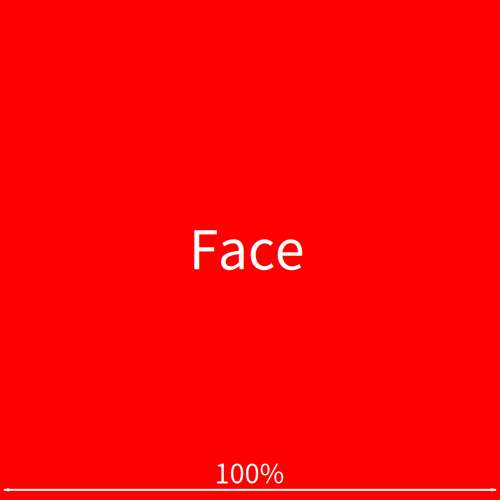
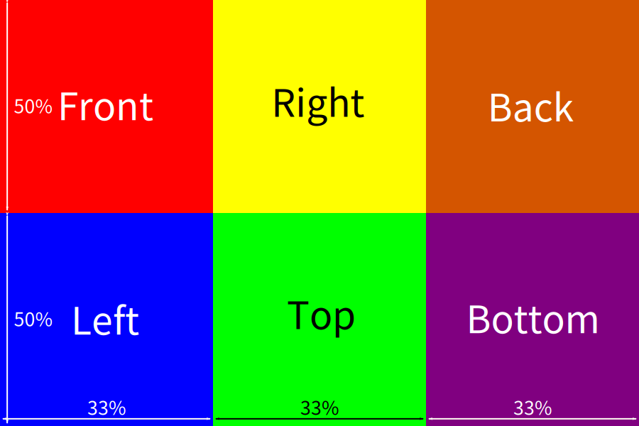
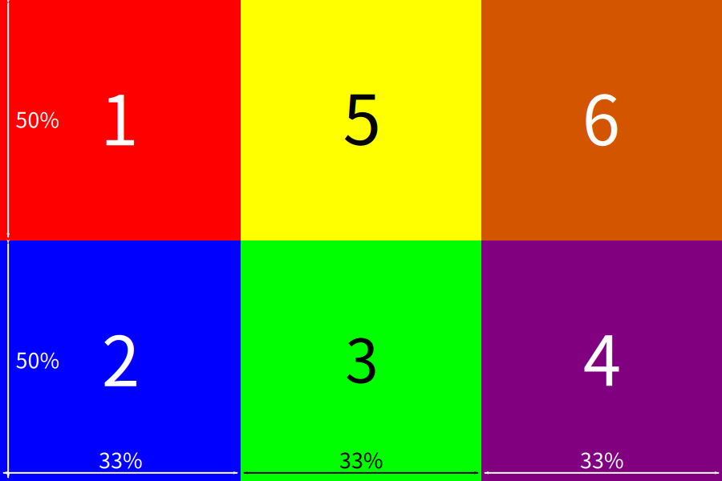

# OpenTabletop Assets

One of the really cool things about OpenTabletop is that you can create,
modify, and use your own (or someone else's) assets in the game using your
favourite image-editing/3d-modelling/text-editing software, all without having
to edit the game or use Godot!

## Asset Pack Structure

To make the management and sharing of custom assets easier, the assets in this
folder are split up into **packs**. Each pack has a set of assets within it
that are divided into different sub-folders depending on what type of asset it
is. The game comes with the default OpenTabletop asset pack included.

### Sub-folders

| Sub-folder             | File Type  | Asset Type  | Object Type | Stackable? |
| :--------------------- | :--------- | :---------- | :---------- | :--------- |
| `cards/`               | Image      | Object      | Card        | Yes        |
| `containers/cube/`     | Image      | Object      | Container   | No         |
| `containers/custom/`   | 3D         | Object      | Container   | No         |
| `containers/cylinder/` | Image      | Object      | Container   | No         |
| `dice/d4/`             | Image      | Object      | Dice        | No         |
| `dice/d6/`             | Image      | Object      | Dice        | No         |
| `dice/d8/`             | Image      | Object      | Dice        | No         |
| `games/`               | Table      | Game        | N/A         | N/A        |
| `music/`               | Audio      | Music       | N/A         | N/A        |
| `pieces/cube/`         | Image      | Object      | Piece       | No         |
| `pieces/custom/`       | 3D         | Object      | Piece       | No         |
| `pieces/cylinder/`     | Image      | Object      | Piece       | No         |
| `skyboxes/`            | Image      | Skybox      | N/A         | N/A        |
| `sounds/`              | Audio      | Sound       | N/A         | N/A        |
| `speakers/cube/`       | Image      | Object      | Speaker     | No         |
| `speakers/custom/`     | 3D         | Object      | Speaker     | No         |
| `speakers/cylinder/`   | Image      | Object      | Speaker     | No         |
| `tokens/cube/`         | Image      | Object      | Token       | Yes        |
| `tokens/cylinder/`     | Image      | Object      | Token       | Yes        |

## File Types

### Image

#### Supported Formats

By default, OpenTabletop supports all of the image formats that Godot supports,
the list of which can be found
[here](https://docs.godotengine.org/en/3.2/getting_started/workflow/assets/importing_images.html).

#### UV Mappings

Every object that uses an image has something called a UV mapping, a way in
which the image is "folded" onto the 3D object. Knowing these UV mappings is
important if you want your object to look right in-game!

**NOTE:** The width and height of the images doesn't matter, as long as the
proportions are correct!

##### Card


##### Cube


##### Cylinder


##### D4


##### D6


##### D8


### 3D

3D models can be exported from almost any 3D modelling software, including
Blender and Maya.

As of right now, OpenTabletop supports the following 3D file formats:

* Collada (`.dae`)
* glTF 2.0 (`.glb`, `.gltf`)
* Wavefront (`.obj`)

### Audio

As of right now, OpenTabletop supports the `.mp3`, `.ogg`, and `.wav` audio
file formats. You can find more information about which format works best for
you by looking at the
[importing audio documentation](https://docs.godotengine.org/en/stable/getting_started/workflow/assets/importing_audio_samples.html)
for Godot.

### Table

Table files (`.table`) are saved OpenTabletop table states, which can be loaded
again later. You can create table files by playing the game, then by going to
the menu and clicking "Save game". You can load the table state back by
clicking the "Load game" button in the same menu.

## Asset Types

### Object

An object in OpenTabletop refers to anything that can be moved and is also
physics-driven. There are many different types of objects, each with their own
special functionality (see below).

### Sound / Music

Sounds and music can be played in-game with either speakers or timers.
Music can also be set to play in the main menu (see `config.cfg` below).

### Game

A game is a table file that has been pre-made such that players can instantly
setup the table to play a particular game.

### Skybox

Skyboxes are special textures that determine what the background looks like.

Skybox textures need to have equirectangular mappings, instead of using cube
mappings. Godot recommends using
[this tool](https://danilw.github.io/GLSL-howto/cubemap_to_panorama_js/cubemap_to_panorama.html)
to convert cube maps to equirectangular maps.

For the best lighting quality, it is recommended to use a HDR panorama.
OpenTabletop supports the Radiance HDR (`.hdr`) and OpenEXR (`.exr`) formats.

Here is an example of a skybox texture:


## Object Types

**TODO:** Add images of each of the different object types.

### Card

Cards are flat, rectangular-shaped objects that are stackable, and they have
the unique functionality to be able to be put in a player's hand.

### Container

Containers are special objects that can hold an unlimited amount of other
objects (including other containers!) inside themselves. Objects inside
containers are invisible. Objects can be placed inside containers by dropping
them on top of the container, and objects can be ramdomly removed from the
container by quickly dragging from the container.

### Dice

Dice are objects that, when shaken, randomize their orientation.

### Piece

Pieces are generic objects that have no special functionality.

### Speaker

Speakers are objects that can play audio tracks. Note that the sound emits from
the object itself, so the audio will vary depending on the position and movement
of the object.

### Token

Tokens are objects that are stackable, similar to cards.

**NOTE:** Tokens stack vertically, so the top and bottom faces will be
connected end-to-end when they are stacked.

## Configuration Files

### config.cfg

Every subfolder can have this file, which allows you to modify the properties
of objects in the subfolder.

#### Properties
| Name            | Data Type | Used By    | Default Value      | Description |
| :-------------- | :-------- | :--------- | :----------------- | :---------- |
| `desc`          | Text      | All        | `""`               | Describes the asset in more detail.
| `ignore`        | Boolean   | All        | `false`            | If `true`, it tells the game to ignore this asset when importing the asset pack.
| `main_menu`     | Boolean   | Music      | `false`            | If `true`, the music will have a chance of playing in the main menu.
| `mass`          | Number    | Objects    | `1.0`              | The mass of the object in grams (g) when it is spawned in-game. It is recommended to set this value for more realistic physics collisions.
| `opening_angle` | Number    | Containers | `30.0`             | The maximum angle in degrees at which objects can enter the top of the container. A lower value means the object needs to be directly on top of the container, and a higher value means the object can be further away and still be able to enter the container.
| `scale`         | Vector3   | Objects    | `Vector3(1, 1, 1)` | Scales the object in the X, Y and Z axes in centimeters (cm). Note that for objects that use custom 3D models, this value most likely won't reflect the final size of the object.

Here is an example of a `config.cfg` file:

```ini
; The following properties are applied to every object in the subfolder.
[*]

; Setting the description of an object.
desc = "This is an object you can spawn!"

; Setting the mass of an object in grams (g).
mass = 5.0

; Setting the size of an object in centimeters (cm).
scale = Vector3(3.5, 0.5, 5.0)

; The following properties apply only to objects whose name start with
; "Heavy". These properties take precedence over the properties under [*].
[Heavy*]

; Descriptions can be on multiple lines.
desc = "This is one line,

and this is another!"

; This is equivalent to 100g.
mass = 100.0

; The following properties apply only to the given object.
[Temporary.png]

; You can tell the game to not import certain objects.
ignore = true
```

### stacks.cfg

If a subfolder is used for objects that are stackable, you can use this special
file to add pre-filled stacks of those objects to the game. A good example of
this is for adding decks of cards to the game.

Here is an example of a `stacks.cfg` file:

```ini
; This is the name of the stack.
[My Stack]

; You can also give stacks descriptions.
desc = "This is my stack. It's awesome!"

; You then specify which objects are in the stack.
; Note that all of the objects need to be the same size.
items = [
    "Card 1.png",
    "Card 2.png",
    "Card 3.png"
]

; This is the name of another stack.
[My Friends Stack]

desc = "My friend's stack isn't as good as my stack!"

; It doesn't matter if each object is on a new line.
items = ["Trading Card 1.jpg", "Trading Card 2.jpg"]
```
